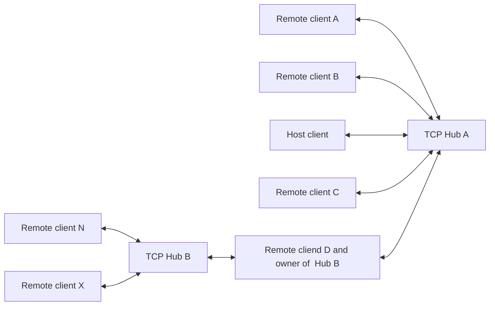

<div align="center">

# TCPTunnel

### A lightweight multiplayer TCP chat for Windows cmd terminals

[](https://dotnet.microsoft.com/download/dotnet/8.0)
[](#requirements)
[](#how-it-works)
[](#building-from-source)

**Host a chat, connect multiple people, and keep everything inside one portable executable.**

</div>

---

TCPTunnel is a nostalgic Windows console chat brought back to 80's vibes with a stable asynchronous TCP core, an animated terminal interface, automatic UPnP port mapping, and a portable single-file application binary.

> [!IMPORTANT]
> Chat traffic is currently sent as plain TCP **without encryption**. Do not use TCPTunnel for confidential conversations on untrusted networks, encryption in my plans!

## Highlights

| | Feature | Description |
|:--:|---|---|
| 🌐 | Multiplayer Hub | One process hosts the TCP Hub and connects the local user—no second console window required. |
| 💬 | Reliable chat | Ordered message delivery, preserved input during incoming messages, and clean disconnect handling. |
| 🖼️ | ASCII media | Drag a JPEG, PNG, GIF, or optional WebP into the input. GIF previews animate in-place without redrawing the whole console. |
| @  | Mentions | Existing participants are highlighted by `@durak go drink vodka`; direct mentions blink in-chat and request attention on the Windows taskbar. |
| 🧵 | Asynchronous server | Multiple clients are handled without creating a dedicated thread for every connection. |
| 🛡️ | Stability limits | Authentication timeout, message-size limits, rate limiting, duplicate nickname protection, and strict UTF-8 validation. |
| 🖥️ | ConsoleGraphics | Animated menu, bounded text rendering, fast frame drawing, and an optional classic plain-console mode. |
| 🔌 | UPnP / NAT-PMP | Attempts UPnP first, falls back to NAT-PMP, and removes the selected TCP mapping on shutdown. |
| 📦 | Lightweight EXE | A native bootstrapper keeps the distributable close to the original size and opens the official .NET 8 download page when the runtime is missing. |
| 🎨 | Saved profiles | Nickname, recent endpoint, language, colors, and snake design are restored from a per-user profile. **(Testing)** |

## Recent updates

- Added safe ASCII image sharing for JPEG, PNG, and optional WebP sources without transmitting the original file or its metadata.
- Added animated GIF sharing with WIC frame composition, bounded frame timing, atomic Hub delivery, in-chat playback, and an animated `/look` viewer.
- Added consistent sender/receiver image sizing and the `/look` viewer for previews that need substantial downscaling.
- Expanded `.cfg` profiles with the full interface palette, live color previews, and reliable theme application after import.
- System messages, Hub startup notices, and the endpoint card now follow the configured system color instead of hard-coded success colors.
- Added the lightweight native launcher, automatic .NET 8 runtime check, and a reproducible lite publish command.

## Quick start

### [Download latest TCPTunnel release version](https://github.com/alextmsv/TcpTunnel/releases/latest)

Attention! TCPTunnel **above** v1.3.0 requires [.NET 8.0 **desktop runtime**](https://dotnet.microsoft.com/download/dotnet/8.0) installed!

### Host a chat

1. Run `TCPTunnel.exe`.
2. Enter a nickname.
3. Select **Create server**.
4. Choose a TCP port or press <kbd>Enter</kbd> to use `9091`.
5. Share your public IP address and port with the other participants.
6. Have fun!

The Hub runs in the background of the same process, while the host connects locally through `127.0.0.1`. TCPTunnel displays the public IPv4 address from [ipify](https://api.ipify.org) when it can be resolved; otherwise it reports the fallback and shows the active local IPv4 address. !**(ipify not available in Russia)**

### Join a chat

1. Run `TCPTunnel.exe`.
2. Select **Connect to server**.
3. Enter the host name or IP address.
4. Enter the server port.
5. Have fun! x2

### Share an image

Drag exactly one `.jpg`, `.jpeg`, `.png`, or `.gif` file from Explorer into the chat input and press <kbd>Enter</kbd>. TCPTunnel decodes it locally, removes all container metadata, and sends a small 4-bit grayscale raster—not the original file, filename, or path. Paths containing spaces and quoted paths are supported.

`.webp` follows the same flow when a compatible Windows Imaging Component codec is installed. If the codec is unavailable, the error remains local and the chat connection stays active.

GIF frames are composed according to their disposal metadata and animate directly inside the existing chat rectangle. Large or heavily reduced images and GIFs remain compact inside the chat; use `/look` after the prompt to open the most recent one in a maximized plain console window.

### Chat commands

| Command | Action |
|---|---|
| `/help` | Show the available commands and their syntax. |
| `/status` | Show the local Hub and UPnP status. |
| `/ping <host:port>` | Check an endpoint locally without sending the command to other participants. |
| `/clear` | Clear only your local chat history while keeping the session and interface active. |
| `/look` | Open the most recent large image or GIF in a separate plain console window. |
| `/stop` | Hub owner: stop the local Hub. Participant: pause or resume their synchronized border snake. |
| `/kick @nickname ["reason"]` | Local Hub owner: notify and disconnect one participant. |
| `/exit` | Leave the current chat and return to the menu. |

## How it works



The Hub authenticates each nickname, receives length-prefixed UTF-8 messages, and broadcasts them to all other authenticated clients in a consistent order.
Even if you hosting an other hub, you can connect to anyone and checking by doing ```/status``` there to see a status of YOUR hub

### Protocol limits

- Maximum encoded frame: **16 KiB**
- Maximum chat message: **2,000 characters**
- Maximum image raster: **160 × 72**, packed at **4 bits/pixel**
- Maximum image control frame: **8 KiB**
- Maximum GIF: **500 frames**, **60 seconds**, **90–2,000 ms** per composed frame
- Authentication timeout: **7 seconds**
- Rate limit: **5 messages/second**, with a short burst allowance
- Image rate limit: **1 image per 5 seconds**, with a burst of 2
- Nickname length: **3–20 characters**, unique per Hub

## Command-line options

```text
TCPTunnel.exe [options]
```

| Option | Example | Description |
|---|---|---|
| `-nickname <name>` | `-nickname HeWhoMustNotBeNamed` | Set the nickname before opening the menu. |
| `-create <port>` | `-create 9091` | Start a Hub and connect to it locally. |
| `-connect <host:port>` | `-connect cool.tcptunnel.hub:9091` | Connect directly to a Hub. |
| `-ping <host:port>` | `-ping cool.tcptunnel.hub:9091` | Check whether a TCP endpoint is reachable. |
| `-no-graphics` | `-no-graphics` | Disable ConsoleGraphics without CG's option |
| `-graphics <on\|off>` | `-graphics off` | Explicitly enable or disable ConsoleGraphics. (Can be switched in CG's options)|
| `-self-test` | `-self-test` | Verify protocols, configuration parsing, localization, and command handling. |
| `-stress-test` | `-stress-test` | Run the loopback broadcast, framing, ordering, and targeted-disconnect stress suite. |
| `-lang <en/ru>` | `-lang ru (by default)` | Switch current language. Have the option in main menu. |

Example:

```powershell
TCPTunnel.exe -nickname VodkaMan -connect cool.tcptunnel.hub:9091 -graphics on -lang en
```

## Internet connectivity and NAT

TCPTunnel first attempts to create a UPnP mapping for the selected TCP port, then falls back to a renewable NAT-PMP lease. This works only when at least one of these protocols is enabled and supported by the router.

When a Hub starts, TCPTunnel makes a short HTTPS request to [ipify](https://www.ipify.org/) to determine the public IPv4 address shown to the host. No nickname or chat data is sent. If the request cannot be completed within three seconds, the Hub continues normally and displays the active local IPv4 address instead.

If other people cannot connect, check the following:

1. Allow `TCPTunnel.exe` through Windows Firewall.
2. Forward the selected TCP port manually on the host router.
3. Confirm that the ISP provides a public IP address.

> [!NOTE]
> UPnP cannot bypass strict NAT or carrier-grade NAT (CGNAT). Those networks require a public relay/VPS, a VPN with port forwarding, or another tunnelling solution.

## Requirements

- Windows 10 or newer

Official lightweight builds require the [.NET 8 Runtime](https://dotnet.microsoft.com/download/dotnet/8.0). The native launcher checks this before starting managed code and automatically opens the official download page when a compatible x64 runtime is unavailable.

Building from source requires the [.NET 8 SDK](https://dotnet.microsoft.com/download/dotnet/8.0) or a newer SDK capable of targeting `net8.0-windows`.

Creating the lightweight release EXE also requires Visual Studio Build Tools with **Desktop development with C++** and a Windows SDK. A normal Debug or Release build of the managed project only requires the .NET SDK.

## Building from source

### Visual Studio

1. Open `TCPTunnel.sln`.
2. Select the **Release** configuration.
3. Press <kbd>Ctrl</kbd> + <kbd>B</kbd> to compile and debug the project.
4. Open a terminal in the project directory and run `dotnet msbuild -t:PublishLite -p:Configuration=Release` to create the distributable executable.


   or just go [releases](https://github.com/alextmsv/TcpTunnel/releases/latest) lol

### Command line

```powershell
dotnet restore .\TCPTunnel.sln
dotnet build .\TCPTunnel.sln -c Release
dotnet msbuild .\TCPTunnel.csproj `
  -t:PublishLite `
  -p:Configuration=Release
```

The distributable executable is created under:

```text
bin\Release\net8.0-windows\win-x64\publish\TCPTunnel.exe
```

Only that executable needs to be distributed. On first launch it extracts its small managed payload under `%LocalAppData%\TCPTunnel\runtime`, then hosts it inside the original `TCPTunnel.exe` process. Trimming and NativeAOT are intentionally disabled to preserve compatibility.

The lite build has a hard **20 MiB** size gate and fails if the final executable exceeds it.

The immutable `default.cfg` is embedded in that executable. Personal profiles are generated under `%LocalAppData%\TCPTunnel\profiles`; they are runtime data and do not need to be distributed with the program.

Verify a copied executable at any time:

```powershell
.\TCPTunnel.exe -self-test
```

Expected output:

```text
TCPTunnel self-test: OK
```

## Project structure

```text
TCPTunnel
├── Broadcaster.cs              # Ordered multi-client broadcasting
├── Bootstrapper/               # Native .NET 8 check and in-process launcher
├── ApplicationSettings.cs      # Atomic per-user profile persistence
├── Client.cs                   # Client state, sending, and rate limits
├── ConsoleGraphic.cs           # Console frame and bounded output
├── ConsoleTitleAnimator.cs     # Console title live animation, works only when CG's ON
├── ConsoleTheme.cs             # Customizable terminal color palette
├── ImageCodec.cs               # Safe image decoding and grayscale packing
├── ImageCodec.Animation.cs     # Bounded WIC GIF decoding and frame composition
├── ImageInput.cs               # Drag-and-drop image path recognition
├── ImageProtocol.cs            # Compact image transfer frames and validation
├── ImageAnimationProtocol.cs   # Ordered BEGIN/FRAME/END animation transport
├── ImageRenderer.cs            # Stable ASCII conversion and chat previews
├── ImageViewer.cs              # Separate full-size /look console viewer
├── LegacyEventProtocol.cs      # Safely ignores event packets from older releases
├── Localization.cs             # Translations container
├── Menu.cs                     # Menu and launch arguments
├── MessageProtocol.cs          # Length-prefixed UTF-8 protocol
├── NetworkAddressResolver.cs   # Public/local IPv4 discovery and endpoint formatting
├── NetWorker.cs                # Authentication, sessions, UPnP, and NAT-PMP
├── ServerInterface.cs          # Hub lifecycle and accept loop
├── SnakeProtocol.cs            # Custom UI-snake profile transmission
├── StabilityTests.cs           # Loopback network stress checks
├── SystemMessageProtocol.cs    # "Language" for system ivents
├── UserInterface.cs            # Interactive chat and input rendering
├── WindowAttention.cs          # Windows taskbar attention notifications
├── build-lite.ps1              # Reproducible lightweight release builder
```

## Roadmap

- [V] Add english language support
- [ ] End-to-end encrypted chat
- [ ] Relay mode for strict NAT and CGNAT
- [ ] Improved connection discovery and invitations
- [ ] Automated integration tests

---

<div align="center">

Made with nostalgic vibes by **alextmsv**.

</div>
