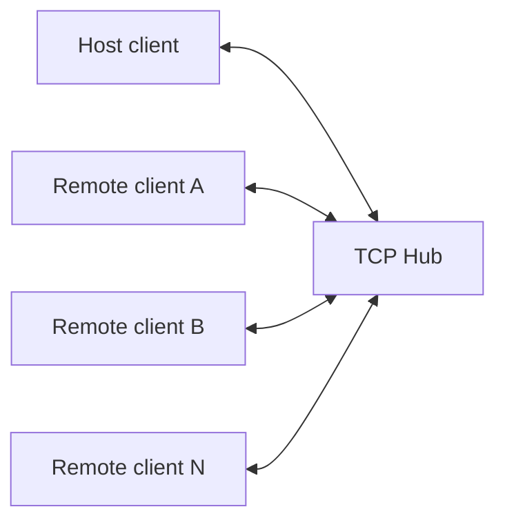

<div align="center">

# TCPTunnel

### A lightweight multiplayer TCP chat for Windows cmd terminals

[](https://dotnet.microsoft.com/download/dotnet-framework/net472)
[](#requirements)
[](#how-it-works)
[](#building-from-source)

**Host a chat, connect multiple people, and keep everything inside one portable executable.**

</div>

---

TCPTunnel is a nostalgic console chat brought back to life with a stable asynchronous TCP core, an animated terminal interface, automatic UPnP port mapping, and a portable single-file application binary.

> [!IMPORTANT]
> Chat traffic is currently sent as **plain TCP without encryption**. Do not use TCPTunnel for confidential conversations on untrusted networks, encryption in my plans!

## Highlights

| | Feature | Description |
|:--:|---|---|
| 🌐 | Multiplayer Hub | One process hosts the TCP Hub and connects the local user—no second console window required. |
| 💬 | Reliable chat | Ordered message delivery, preserved input during incoming messages, and clean disconnect handling. |
| 🧵 | Asynchronous server | Multiple clients are handled without creating a dedicated thread for every connection. |
| 🛡️ | Stability limits | Authentication timeout, message-size limits, rate limiting, duplicate nickname protection, and strict UTF-8 validation. |
| 🖥️ | ConsoleGraphics | Animated menu, bounded text rendering, fast frame drawing, and an optional classic plain-console mode. |
| 🔌 | UPnP / NAT-PMP | Attempts UPnP first, falls back to NAT-PMP, and removes the selected TCP mapping on shutdown. |
| 📦 | Single EXE | `Open.Nat.dll` is embedded into `TCPTunnel.exe`; no adjacent application DLLs are required. |

## Quick start

### Host a chat

1. Run `TCPTunnel.exe`.
2. Enter a nickname.
3. Select **Create server**.
4. Choose a TCP port or press <kbd>Enter</kbd> to use `9091`.
5. Share your public IP address and port with the other participants.
6. Have fun!

The Hub runs in the background of the same process, while the host connects locally through `127.0.0.1`.

### Join a chat

1. Run `TCPTunnel.exe`.
2. Select **Connect to server**.
3. Enter the host name or IP address.
4. Enter the server port.
5. Have fun! x2

### Chat commands

| Command | Action |
|---|---|
| `/status` | Show the local Hub and UPnP status. |
| `/stop` | Hub owner: stop the local Hub. Participant: pause or resume their synchronized border snake. |
| `/exit` | Leave the current chat and return to the menu. |

## How it works



The Hub authenticates each nickname, receives length-prefixed UTF-8 messages, and broadcasts them to all other authenticated clients in a consistent order.

### Protocol limits

- Maximum encoded frame: **16 KiB**
- Maximum chat message: **2,000 characters**
- Authentication timeout: **7 seconds**
- Rate limit: **5 messages/second**, with a short burst allowance
- Nickname length: **3–20 characters**, unique per Hub

## Command-line options

```text
TCPTunnel.exe [options]
```

| Option | Example | Description |
|---|---|---|
| `-nickname <name>` | `-nickname HeWhoMustNotBeNamed` | Set the nickname before opening the menu. |
| `-create <port>` | `-create 9091` | Start a Hub and connect to it locally. |
| `-connect <host:port>` | `-connect cool.tcptunnel.hub:9091` | Connect directly to a Hub. |
| `-ping <host:port>` | `-ping cool.tcptunnel.hub:9091` | Check whether a TCP endpoint is reachable. |
| `-no-graphics` | `-no-graphics` | Disable ConsoleGraphics without CG's option |
| `-graphics <on\|off>` | `-graphics off` | Explicitly enable or disable ConsoleGraphics. (Can be switched in CG's options)|
| `-self-test` | `-self-test` | Verify that the embedded `Open.Nat` dependency loads correctly. |

Example:

```powershell
TCPTunnel.exe -nickname VodkaMan -connect cool.tcptunnel.hub:9091 -graphics on
```

## Internet connectivity and NAT

TCPTunnel first attempts to create a UPnP mapping for the selected TCP port, then falls back to a renewable NAT-PMP lease. This works only when at least one of these protocols is enabled and supported by the router.

If other people cannot connect, check the following:

1. Allow `TCPTunnel.exe` through Windows Firewall.
2. Forward the selected TCP port manually on the host router.
3. Confirm that the ISP provides a public IP address.

> [!NOTE]
> UPnP cannot bypass strict NAT or carrier-grade NAT (CGNAT). Those networks require a public relay/VPS, a VPN with port forwarding, or another tunnelling solution.

## Requirements

- Windows
- .NET Framework **4.7.2 or newer**

Modern Windows installations commonly include a compatible .NET Framework runtime. If the application does not start, install the [.NET Framework 4.7.2 runtime](https://dotnet.microsoft.com/download/dotnet-framework/net472) or a newer 4.x version.

## Building from source

### Visual Studio

1. Open `TCPTunnel.sln`.
2. Select the **Release** configuration.
3. Press <kbd>Ctrl</kbd> + <kbd>B</kbd>.
4. Find the portable executable at `bin\Release\TCPTunnel.exe`.


   or just go [releases](https://github.com/alextmsv/TcpTunnel/releases/latest) lol

### Command line

```powershell
dotnet restore TCPTunnel.sln -p:RestorePackagesConfig=true
dotnet build TCPTunnel.sln -c Release
```

The Release directory also contains debugging and runtime metadata, but only `TCPTunnel.exe` needs to be distributed. The target computer still needs a compatible .NET Framework runtime.

Verify a copied executable at any time:

```powershell
.\TCPTunnel.exe -self-test
```

Expected output:

```text
TCPTunnel self-test: OK
```

## Project structure

```text
TCPTunnel
├── MessageProtocol.cs          # Length-prefixed UTF-8 protocol
├── ServerInterface.cs          # Hub lifecycle and accept loop
├── NetWorker.cs                # Authentication, sessions, and UPnP
├── Broadcaster.cs              # Ordered multi-client broadcasting
├── Client.cs                   # Client state, sending, and rate limits
├── UserInterface.cs            # Interactive chat and input rendering
├── ConsoleGraphic.cs           # Console frame and bounded output
├── Menu.cs                     # Menu and launch arguments
└── EmbeddedAssemblyResolver.cs # Single-EXE dependency loader
```

## Roadmap

- [ ] Add english language support
- [ ] End-to-end encrypted chat
- [ ] Relay mode for strict NAT and CGNAT
- [ ] Improved connection discovery and invitations
- [ ] Automated integration tests

---

<div align="center">

Made with nostalgia by **alextmsv**.

</div>
